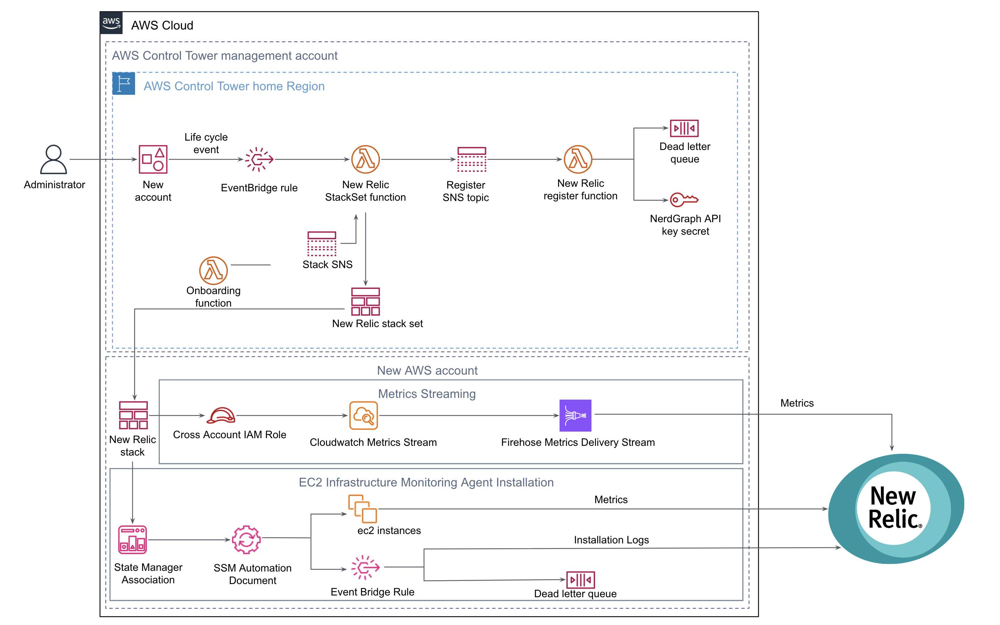

:xrefstyle: short

// Replace this example diagram with your own. Follow our wiki guidelines: https://w.amazon.com/bin/view/AWS_Quick_Starts/Process_for_PSAs/#HPrepareyourarchitecturediagram. Upload your source PowerPoint file to the GitHub {deployment name}/docs/images/ directory in this repo. 

Deploying this Quick Start with default parameters builds the following {partner-product-short-name} in the AWS Control Tower environment on the AWS Cloud.

[#NewRelic-CT-arch]
.{partner-product-short-name} Quick Start Solution diagram

* Onboarding Lambda function, creates the New Relic StackSet. The stackset template creates the New Relic IAM cross account role for New Relic One integration.
* Stack SNS topic, to register existing AWS Accounts with New Relic One integration.
* Admin enroll new or existing AWS accounts into AWS Control Tower, which generates LifeCycle event.
*  LifeCycle event triggers New Relic StackSet Lambda function via EventBridge rule, to setup the New Relic One integrations.
* New Relic StackSet Lambda function creates new StackSet Instance.
* Upon New Relic StackSet instance completion, New Relic StackSet function trigger New Relic Register function via SNS.
* Register function calls the New Relic NerdGraph endpoint mutation to link the newly vended AWS account with New Relic Account, using the New Relic NerdGraph API Key secret retrieved from AWS Secret Manager.
