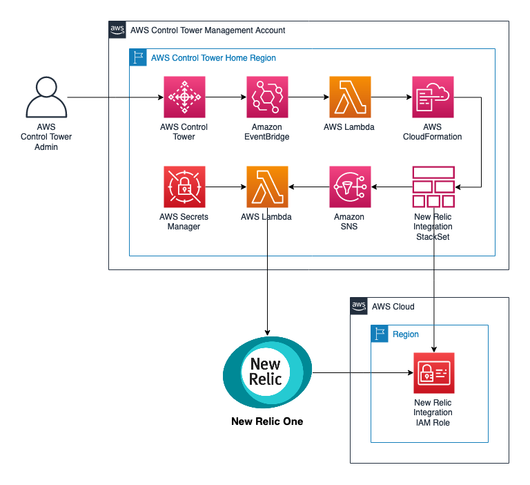

:xrefstyle: short

Deploying this Quick Start for a new virtual private cloud (VPC) with
default parameters builds the following {partner-product-short-name} environment in the
AWS Cloud.

// Replace this example diagram with your own. Follow our wiki guidelines: https://w.amazon.com/bin/view/AWS_Quick_Starts/Process_for_PSAs/#HPrepareyourarchitecturediagram. Upload your source PowerPoint file to the GitHub {deployment name}/docs/images/ directory in this repo. 

The solution is deployed using AWS CloudFormation templates and integrates with AWS Control Tower LifeCycle events. When a new account is created or enrolled using the AWS Control Tower account factory, the LifeCycle event triggers the Lambda function to launch CloudFormation StackSet instance. The StackSet instance creates the required IAM role in the new account. On completion of the StackSet instance, Lambda function pull New Relic NergGraph API key and secret from AWS Secret Manager and register the IAM role into New Relic.

[#NewRelic-CT-arch]
.{partner-product-short-name} Quick Start Solution diagram

<<Figure 1>> shows a high-level view of deployment with two worklow. **Workflow A** runs during initial deployment of {partner-product-short-name}. **Workflow B** runs during enrollment of new AWS accounts.

* **Workflow A**

** A1 : CloudFormation `control-tower-customization.yml` stack launched and deploys all Lambda functions and the required resources. Optional parameter include list of AWS accounts to be included in the first launch.
** A2 : CloudFormation custom resource calls `Onboarding` Lambda for the first time, passing all the required parameters.
** A3 : `New Relic Integration StackSet` is launched with predefined parameters.
** A4 : `Onboarding Lambda` queue the creation of StackSet instance for AWS accounts that included in the first launch.
** A5 : SNS topic invoke the `StackSet` Lambda.
** 6 : `StackSet` Lambda create new StackSet instance.
** 7 : Upon StackSet instance completion, send message to `Register` SNS topic.
** 8 : `Register` Lambda retrieves API secret key from AWS Secret Manager and register IAM role to New Relic.

**Workflow B**

** B1 : Admin enroll new or existing AWS account into AWS Control Tower.
** B2 : `CreateManagedAccount` AWS Control Tower LifeCycle event triggers the `StackSet` Lambda
** 6 : `StackSet` Lambda create new StackSet instance.
** 7 : Upon StackSet instance completion, send message to `Register` SNS topic.
** 8 : `Register` Lambda retrieves API secret key from AWS Secret Manager and register IAM role to New Relic.

On both workflow, `Register` Lambda is set to enable **all** AWS integration available in New Relic.